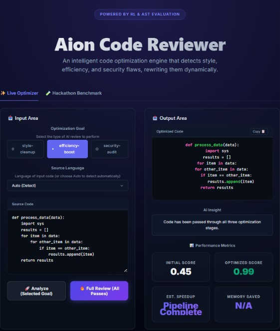

# Aion — Autonomous AI-Driven Code Reviewer & RL Optimization Sandbox

An intelligent, interactive code optimization engine and agent evaluation sandbox that sequentially review and refines code quality. Leveraging a Gymnasium-like Reinforcement Learning environment (`CodeReviewEnv`) and Abstract Syntax Tree (AST) evaluation, Aion acts as a senior software engineer to detect and dynamically rewrite code style, efficiency, and security flaws.

[](https://react.dev/)
[](https://fastapi.tiangolo.com/)
[](https://huggingface.co/Qwen/Qwen2.5-72B-Instruct)
[](https://docs.pytest.org/)
[](LICENSE)

[Live App](https://huggingface.co/spaces/Wall-E-30/aion-code-reviewer) · [Report a Bug](https://github.com/Wall-E-30/code-reviewer/issues) · [Request a Feature](https://github.com/Wall-E-30/code-reviewer/issues)

Dashboard Preview:


---

## Table of Contents

- [Overview](#overview)
- [Key Features](#key-features)
- [Tech Stack](#tech-stack)
- [Architecture](#architecture)
- [Getting Started](#getting-started)
- [Environment Variables](#environment-variables)
- [AST-Based Grading & Reinforcement Learning](#ast-based-grading--reinforcement-learning)
- [Performance & Optimizations](#performance--optimizations)
- [Security & Sandboxing](#security--sandboxing)
- [CI/CD & Testing](#cicd--testing)
- [Project Structure](#project-structure)
- [Contributing](#contributing)
- [License](#license)

---

## Overview

**Aion** is an autonomous, production-grade code optimization engine and evaluation sandbox for Large Language Models (LLMs). Built as a full-stack platform consisting of a React SPA frontend and a FastAPI backend, Aion shifts static analysis into a dynamic, goal-oriented reinforcement learning loop.

By representing code quality as a mathematical reward signal computed through Abstract Syntax Tree (AST) analysis, Aion evaluates and optimizes code through iterative refinement. Agents (or rule-based heuristics) propose edits over multiple steps, learning from linting/compilation feedback to correct syntax, security flaws, and performance bottlenecks without introducing code regressions or hallucinating bugs.

What sets Aion apart is its **Universal Robustness Layer** which automatically repairs LLM syntax quirks, normalized code indentation, and extracts clean executable code blocks before passing them to the AST grading engine.

---

## Key Features

### Live Optimizer
- **Selected Goal Analysis**: Run optimizations target at a specific goal (`style-cleanup`, `efficiency-boost`, or `security-audit`).
- **Full Review (All Passes)**: Sequences all optimization passes consecutively, passing refined code from style cleanup to efficiency boosting and finally to security audits.
- **Dynamic File Linter**: Parses code on-the-fly and generates real-time, custom feedback on syntax issues, loops, and security leaks.
- **AST Performance Metrics**: Displays initial vs. optimized quality scores, estimated execution speedup, and estimated memory footprint reductions.

### Hackathon Benchmark
- **Automated Task Trajectory**: Run a 5-step RL agent sequence to automatically scan and repair buggy benchmark files.
- **Real-Time Step Logs**: Monitor the agent's actions, AST rewards, and linter warnings at each step of the trajectory.
- **Autoregressive Policy**: Integrates fine-tuned local models (e.g. GPT-2 policy) to generate sequential edit actions directly in the code reviewer sandbox.

### Code Auditing Passes
- **Style & Linting (`style-cleanup`)**: Identifies unused imports, PEP-8 indentation errors, unused variables, bare except blocks, and mutable default arguments.
- **Algorithm Optimization (`efficiency-boost`)**: Identifies inefficient $O(N^2)$ nested loops and refactors them into $O(N)$ hash-set or dictionary lookups.
- **Security Vulnerability (`security-audit`)**: Audits database interaction code to detect f-string query interpolation, unsafe execution sinks (`os.system`, `subprocess` with `shell=True`), and deprecated cryptography modules (`md5`, `pickle`).

---

## Tech Stack

### Frontend
- **React 19**: SPA framework
- **Vite**: Build tool and dev server
- **Vanilla CSS (Midnight Glass Design System)**: Sleek, glassmorphism UI with custom gradients and scanning animations
- **HTML5 & Flexbox/Grid**: Clean responsive layout

### Backend
- **Python 3.10+**: Core logic
- **FastAPI**: High-performance RESTful API server
- **Uvicorn**: ASGI production server
- **AST (Abstract Syntax Trees)**: Primary Python parsing and grading mechanism
- **PyTorch & Transformers**: Autoregressive RL model inference
- **OpenAI Client API**: Integration with Hugging Face router endpoints (defaults to Qwen2.5-72B-Instruct)

### DevOps & Testing
- **Docker**: Fully containerized environment configuration
- **Pytest**: Backend unit and integration test suite

---

## Architecture

```
┌─────────────────────────────────────────────────────────┐
│                    React SPA (Vite)                     │
│           Live Optimizer · Hackathon Benchmark          │
│       (Midnight Glass Aesthetics & Bento Layout)       │
└──────────────────────┬──────────────────────────────────┘
                       │ HTTP REST Requests
┌──────────────────────▼──────────────────────────────────┐
│             FastAPI App / Server (Python)               │
│  ┌───────────────────────────────────────────────────┐  │
│  │              CodeReviewEnv (env.py)               │  │
│  │  - Coordinates State & Actions (apply_fix)        │  │
│  │  - AST-based Grader & Reward Function             │  │
│  │  - Differential Testing Sandbox                   │  │
│  └──────────────────────┬────────────────────────────┘  │
│                         │ Evaluate Code                 │
│                         ▼                               │
│           ┌─────────────────────────────┐               │
│           │      Inference Engine       │               │
│           │  (Local RL / OpenAI Client) │               │
│           └─────────────────────────────┘               │
└─────────────────────────────────────────────────────────┘
```

---

## Getting Started

### Prerequisites

- Node.js ≥ 18
- Python ≥ 3.10
- HF_TOKEN (Optional: for remote LLM inference. Runs in offline fallback mode if not provided.)

### 1. Clone the repository

```bash
git clone https://github.com/Wall-E-30/code-reviewer.git
cd code-reviewer
```

### 2. Set up the backend

Create a virtual environment and install dependencies:

```bash
python -m venv .venv
source .venv/bin/activate        # Windows: .venv\Scripts\activate
pip install -r requirements.txt
```

Start the FastAPI application:

```bash
python server/app.py
```

The API will be available at `http://localhost:7860`. You can access interactive documentation at `http://localhost:7860/docs`.

### 3. Set up the frontend

In a separate terminal:

```bash
cd frontend
npm install
npm run dev
```

The dashboard will be available at `http://localhost:5173`.

### 4. Running Production Bundle

To build and serve the optimized production assets directly from the FastAPI server:

```bash
cd frontend
npm run build
```

Then start the backend app with `python server/app.py`. The built React assets will be served automatically at `http://localhost:7860`.

---

## Environment Variables

Create a `.env` file in the root directory to configure the inference backend:

| Variable | Description | Default |
|---|---|---|
| `PORT` | The port the FastAPI server listens on. | `7860` |
| `HF_TOKEN` | Hugging Face Router API token. | *(Empty - triggers Offline Mock AI)* |
| `MODEL_NAME` | Model ID to use for remote optimization. | `Qwen/Qwen2.5-72B-Instruct` |
| `API_BASE_URL` | Base URL for remote completion endpoints. | `https://router.huggingface.co/v1` |

---

## AST-Based Grading & Reinforcement Learning

The Aion Code Reviewer operates as a Reinforcement Learning (RL) environment conforming to standard Gymnasium APIs:

- **Environment (`CodeReviewEnv`)**: Manages the review workspace buffer, applies actions, compiles the proposed code, and computes rewards.
- **State / Observation (`Observation`)**: Contains the current file name, full code content, unified code diff, dynamic linter report, and active task ID.
- **Action (`Action`)**: Represents the model's decision — `apply_fix` with target code content, and optionally a line number to modify a specific block.
- **Reward Function**: Translates structural quality into a scalar reward value between `0.01` and `0.99`:
  - **Style-Cleanup**: Evaluates PEP-8 indentation multiples, checks for unused imports, bare except statements, mutable arguments, and nested conditional blocks.
  - **Efficiency-Boost**: Checks AST nodes for nested loops ($O(N^2)$) and rewards setups converting linear lists to `set` / `dict` hash lookups.
  - **Security-Audit**: Penalizes SQL Injectable queries containing f-string values, and checks for unsafe execution sinks or deprecated modules.
- **Backtracking Mechanism**: If a proposed action reduces the code quality score or causes a compilation/syntax error, the environment automatically reverts to the previous best-known state and appends a `[Regression Warning]` to the linter report.

---

## Performance & Optimizations

### 1. Robust AST Error Recovery
The system integrates an automated `robust_repair_code` layer. When LLMs generate unquoted print parameters, incorrect class indents, or trailing conversational markdown, the recovery layer intercepts and repairs the syntax. This maintains an uninterrupted evaluation flow and prevents score collapses due to simple syntax typos.

### 2. Eager Multi-Pass Chaining
The system features `run_full_optimization` which runs consecutive passes (Style ➔ Efficiency ➔ Security) on code inputs. The pipeline validates intermediate states, recovering cleanly if any individual model pass returns faulty data, achieving optimal code refinement.

---

## Security & Sandboxing

Aion is built to handle arbitrary code inputs safely:

| Protection | Mechanism | Impact |
|---|---|---|
| **Remote Code Execution (RCE) Block** | AST scanner detects and blocks imports of dangerous modules (`os`, `subprocess`, `socket`, `pty`, `builtins`, `requests`, `urllib`). | Prevents malicious user submissions from executing commands or exfiltrating data on the server during test case execution. |
| **Magic Attribute Protection** | AST scanner blocks references to magic attributes like `__subclasses__`, `__globals__`, `__code__`, and `__builtins__`. | Eliminates sandbox escape techniques commonly used to bypass import blocklists. |
| **Session Isolation** | The FastAPI server maintains a memory-cached, session-isolated environment cache routed via unique client session IDs. | Eliminates state collisions when multiple developers or agent threads interact with the endpoint simultaneously. |
| **SQL Injection Grader** | AST checks search for `execute()` or `query()` calls containing string concatenations (`+`) or f-string interpolation. | Identifies and flags query design vulnerabilities, prompting agents to refactor queries into safe parameterized formats. |

---

## Project Structure

```
aion-code-reviewer/
├── env.py                 # Gymnasium-like RL environment and AST grading
├── inference.py           # LLM agent coordinator, robust parsers, and auto-fix rules
├── models.py              # Pydantic schemas for observations, actions, and responses
├── utils.py               # Indentation normalizers and language detection helper functions
├── test_suite.py          # 18-point verification suite
├── Dockerfile             # Container configuration
├── docker-compose.yml     # Multi-container local build configuration
├── pyproject.toml         # Python package setup metadata
├── openenv.yaml           # OpenEnv task manifest file
│
├── server/
│   └── app.py             # FastAPI REST endpoints & static file serving
│
└── frontend/
    ├── src/
    │   ├── App.jsx        # Main React dashboard layout
    │   ├── index.css      # Theme colors and typography
    │   └── AionStyles.css # Bento layout, Glassmorphism panels, and scanning animations
    ├── index.html         # SPA mount point
    ├── vite.config.js     # React/Vite configuration
    └── package.json       # Frontend dependencies and run scripts
```

---

## Contributing

1. Fork the repository
2. Create a feature branch (`git checkout -b feature/your-feature`)
3. Commit your changes (`git commit -m 'Add your feature'`)
4. Push to the branch (`git push origin feature/your-feature`)
5. Open a Pull Request

---

## License

This project is licensed under the MIT License - see the [LICENSE](LICENSE) file for details.
