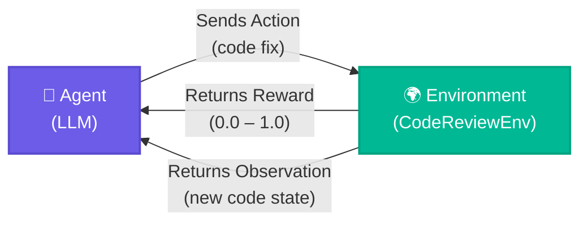
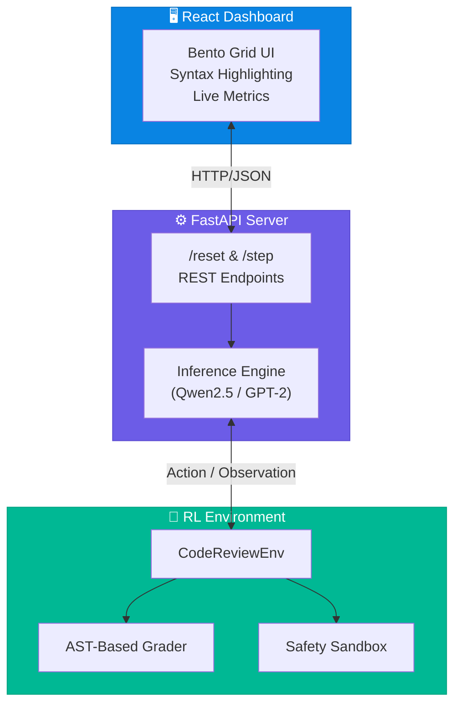
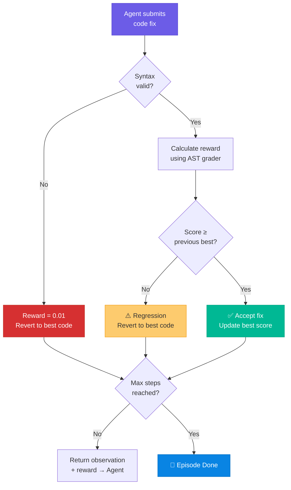
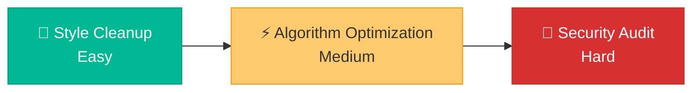
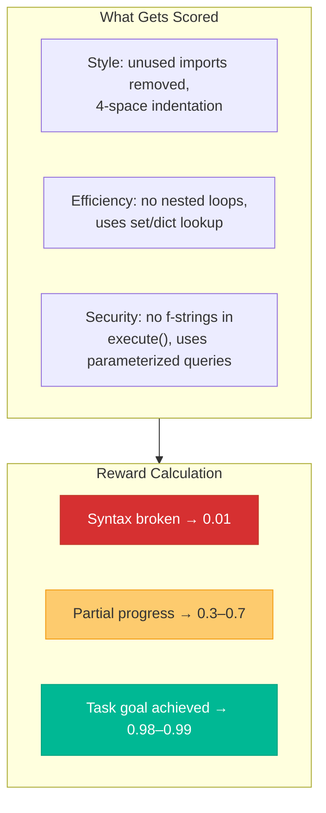
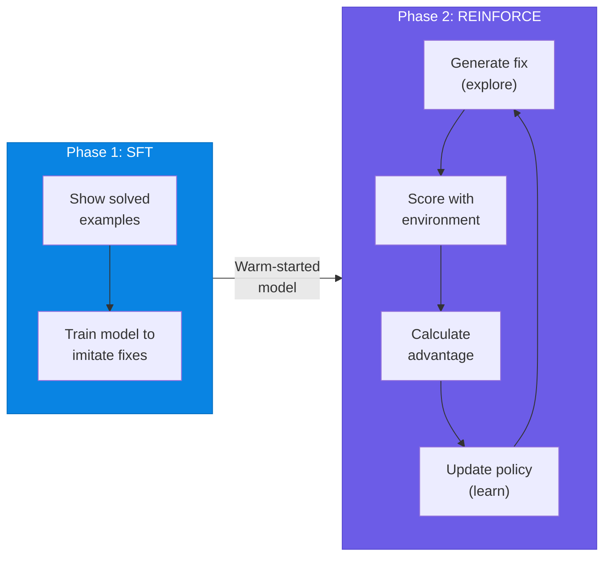

# I Built an AI That Teaches Itself to Fix Your Code — Using Reinforcement Learning

> *How we trained an LLM to think like a senior engineer, not just autocomplete like one.*

---

If you've ever shipped a bug to production, you know the feeling. The code *looked* fine. It ran. The tests passed. And then — at 2 AM — you get a Slack message that everything is on fire.

What if an AI could catch that? Not by pattern-matching on syntax, but by *understanding* what good code looks like, iterating on fixes, and scoring itself until it gets it right?

That's exactly what **Aion** does.

This post is the full story — what Reinforcement Learning actually is (in plain English), why we chose it over a simple prompt, and how the whole system fits together.

---

## 🧠 First, How Does AI Usually Review Code?

Most "AI code reviewers" work like this: you paste code, the AI reads a prompt like *"Review this and suggest fixes,"* and it returns a response. Done.

That's **prompting** — and it works *okay*. But the AI has no idea if its suggestion actually *fixed* anything. It generates text and hopes for the best.

We wanted something smarter. We wanted the AI to have a **feedback loop** — to try, get scored, learn, and try again.

That's where **Reinforcement Learning** comes in.

---

## 🎮 What is Reinforcement Learning? (The Simple Version)

Imagine teaching a dog to sit. You say "sit," the dog does something. If it sits → treat 🍖. If it doesn't → no treat. Over time, the dog learns: sitting = treat.

**Reinforcement Learning (RL)** is the same idea, but for AI.

| Concept | Dog Example | In Aion |
|---|---|---|
| **Agent** | The dog 🐶 | The LLM (Qwen2.5 / GPT-2) |
| **Environment** | The room | Our `CodeReviewEnv` |
| **Action** | Sit, stand, bark | Apply a code fix |
| **Reward** | A treat | A quality score (0.0–1.0) |

Here's what one full RL cycle looks like:



The agent keeps looping — trying, scoring, learning — until it either hits a perfect score or runs out of steps (we cap at 5).

---

## 🏗️ System Architecture

Aion has three layers that work together:



Let's break each layer down.

---

## 🌍 The Environment: The "Judge"

In RL, the **Environment** is the world the agent interacts with. It has two jobs: tell the agent the current state ("observation"), and score the agent's last action ("reward").

### The Step Function

Every interaction follows this flow:



Here's the simplified code:

```python
class CodeReviewEnv:
    def step(self, action: Action):
        proposed_code = action.content

        # 1. Validate syntax
        try:
            ast.parse(proposed_code)
        except SyntaxError:
            return observation, 0.01, False, {}  # Broken → tiny reward

        # 2. Score the fix
        self.code = proposed_code
        reward = self._calculate_reward()

        # 3. Backtrack if it got worse
        if reward < self.best_reward and self.backtrack:
            self.code = self.best_code  # Revert!

        # 4. Check if done
        done = self.step_count >= 5 or reward >= 0.98
        return observation, reward, done, {}
```

The **backtrack mechanism** is key — Aion never gets *dumber* over an episode. It always builds on its best work.

---

## 🎯 The Three Tasks

Aion is a **benchmark** with three progressive challenges. Each tests a different engineering skill.



### Task 1: Style Cleanup 🎨

Fix bad indentation and unused imports.

```python
# ❌ BEFORE                          # ✅ AFTER
import os                            import os
import sys  # unused!                def hello_world():
def hello_world():                       print("Hello")
  print("Hello")  # 2-space!            print("World")
  print("World")
```

The grader checks: *Is `sys` gone? Is every indent exactly 4 spaces?*

### Task 2: Algorithm Optimization ⚡

Refactor O(n²) nested loops into O(n) set lookups.

```python
# ❌ BEFORE: O(n²) — 100M comparisons for 10K items
def find_duplicates(list_a, list_b):
    duplicates = []
    for item_a in list_a:
        for item_b in list_b:        # Nested loop!
            if item_a == item_b:
                duplicates.append(item_a)
    return duplicates
```

```python
# ✅ AFTER: O(n) — 20K operations for 10K items (5,000× faster)
def find_duplicates(list_a, list_b):
    seen = set(list_a)
    return [x for x in list_b if x in seen]
```

The grader uses **AST** to structurally detect nested `For` loops — not just regex on text:

```python
all_loops = [n for n in ast.walk(tree) if isinstance(n, (ast.For, ast.While))]
is_nested = any(
    any(isinstance(child, (ast.For, ast.While))
        for child in ast.walk(node) if child is not node)
    for node in all_loops
)
```

### Task 3: Security Audit 🔐

Find and fix SQL Injection — one of the most dangerous web vulnerabilities.

```python
# ❌ BEFORE: If user_id = "' OR '1'='1", this returns ALL users!
query = f"SELECT * FROM users WHERE id = '{user_id}'"
cursor.execute(query)
```

```python
# ✅ AFTER: Parameterized query — immune to injection
cursor.execute('SELECT * FROM users WHERE id = ?', (user_id,))
```

The grader detects f-strings passed to `execute()` via AST's `ast.JoinedStr` node — Python's internal representation of f-strings.

---

## 🏆 The Reward Function

The reward function translates *"is this code better?"* into a number. This is the **heart** of the system.



We call this **reward shaping** — giving partial credit for intermediate improvements so the agent gets signal at every step, not just at the end.

---

## 🤖 Training Pipeline

We used a two-phase approach — a classic pattern in modern AI research.



### Phase 1: Supervised Fine-Tuning (SFT)

Before RL, we give the model a head start by showing it examples of broken code and their correct fixes.

```python
# Show the model: "Given this broken code, produce this fix"
prompt = "Task: style-cleanup\nCode:\nimport sys\ndef hello():\n  print('hi')\nOptimized:\n"
target = "def hello():\n    print('hi')"

# Only compute loss on the target, not the prompt
labels[0, :len(prompt_ids)] = -100  # Mask prompt tokens
loss = model(input_ids, labels=labels).loss
loss.backward()
```

### Phase 2: REINFORCE with Baseline

The actual RL. The agent generates a fix, gets scored, and updates its policy.

```python
# The core RL loop
for task_id in ["style-cleanup", "efficiency-boost", "security-audit"]:
    generated_code = model.generate(prompt)          # 1. Try
    _, reward, _, _ = env.step(Action(content=generated_code))  # 2. Score

    advantage = reward - baselines[task_id]           # 3. Better than average?
    baselines[task_id] += 0.1 * advantage             # 4. Update baseline

    policy_loss = -log_probs.sum() * advantage        # 5. Learn
    policy_loss.backward()
```

**The key formula:** `policy_loss = -log_probs × advantage`

- `advantage > 0` → loss is negative → model *increases* probability of this action
- `advantage < 0` → loss is positive → model *decreases* probability of this action

The agent literally learns to prefer actions that worked.

---

## 🛡️ The Safety Sandbox

The agent generates arbitrary code. What if it generates `os.system("rm -rf /")`?

We built a **static safety scanner** using AST that runs *before* any execution:

```python
def _is_code_safe_to_execute(self, code: str) -> bool:
    tree = ast.parse(code)
    dangerous_modules = {'subprocess', 'socket', 'requests', ...}
    dangerous_functions = {'eval', 'exec', 'open', ...}

    for node in ast.walk(tree):
        if isinstance(node, ast.Import):
            for alias in node.names:
                if alias.name in dangerous_modules:
                    return False  # Block it
    return True
```

If unsafe → skip execution, score via static analysis only. No exceptions.

---

## 🐛 Real Bugs We Found (And Fixed)

Even the "judge" can have bugs. Here are three real ones:

### Bug 1: Import Alias Bypass

Our grader checked for `subprocess.run(...)` but missed:

```python
import subprocess as sub
sub.run("rm -rf /", shell=True)  # Slipped through!
```

**Fix:** Dynamically track all aliases throughout the AST.

### Bug 2: Set Comprehension Blindspot

The grader detected `set(list_a)` but missed `{x for x in list_a}` — same data structure, different syntax.

**Fix:** Recognize `ast.SetComp`, `ast.DictComp`, `ast.Set`, and `ast.Dict` as valid efficient structures.

### Bug 3: Chained Optimization Failure

Our pipeline ran Style → Efficiency → Security in sequence. If style returned `"Error: could not parse"`, that *error string* was passed as code to the next step.

**Fix:** Intermediate validation at each step. Failed steps carry forward the last valid code.

---

## 💡 What We Learned

**1. AI needs a judge, not just a prompter.** Pairing an LLM with a deterministic AST-based grader gives you the creativity of generative AI + the reliability of traditional tools.

**2. Code optimization is iterative.** Single-shot generation rarely nails complex tasks. Our 5-step episode limit mirrors how real engineers work — draft, review, revise.

**3. Reward shaping is an art.** Zero reward for partial progress = no learning signal. Too much reward for trivial changes = lazy agent. Getting this right was harder than the model architecture.

**4. Transparency builds trust.** Showing users the live linter report, the diff, and the score progression made Aion feel collaborative — not a black box.

---

## 🚀 Try It Yourself

```bash
# Clone and run with Docker
git clone https://github.com/your-org/aion-code-reviewer
cd aion-code-reviewer
docker build -t aion-code-reviewer .
docker run -p 7860:7860 aion-code-reviewer

# Or train the RL pipeline directly
python train_rl.py
```

---

## Final Thoughts

When we started Aion, we thought the hard part would be the ML. It wasn't. The hard part was designing a feedback loop that was **honest** — one that rewarded genuine improvement, punished regressions, and never let the agent cheat.

That, in the end, is what RL is really about. Not just teaching AI to do things. Teaching it to *care about doing them well*.

---

*Built with Python, PyTorch, FastAPI, and a lot of AST walks.*

**Tags:** `#MachineLearning` `#ReinforcementLearning` `#Python` `#AIEngineering` `#CodeReview` `#LLM`
